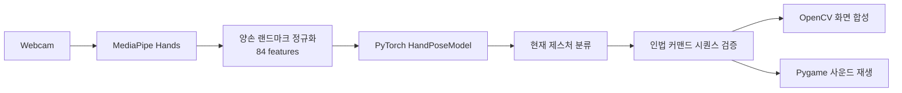

# Ninja Gesture Recognition

웹캠에서 양손 랜드마크를 추출하고, 학습된 모델로 제스처를 분류해 시각 효과와
연결한 팀 프로젝트입니다.

> 부트캠프 팀 프로젝트에서 제가 담당한 데이터 정제, 학습 최적화, 안정화 작업을
> 다시 검토해 포트폴리오용으로 정리한 저장소입니다.

## 동작 화면


양손의 랜드마크를 실시간으로 추적하고, 인식된 제스처 조합에 따라 치도리,
나선환, 호화구의 술, 그림자 분신술 효과를 실행합니다.

## 담당 역할

- 수집 데이터 정제와 잘못된 샘플 제거
- 양손 랜드마크 84개 좌표 입력 형식 통일
- PyTorch 기반 제스처 분류 모델 학습 및 가중치 관리
- 실시간 추론 과정의 오인식과 실행 흔들림 안정화
- 제스처 시퀀스와 콘텐츠 실행 흐름 검증

## 시스템 흐름



## 트러블슈팅

| 문제 | 원인 | 해결 |
|---|---|---|
| 한 손만 인식될 때 모델 입력 크기가 맞지 않음 | 모델은 양손 기준 84개 좌표를 입력으로 사용하지만 한 손만 잡히면 42개 좌표만 생성됨 | 한 손만 감지된 경우 나머지 42개 좌표를 `0.0`으로 채워 입력 크기를 고정 |
| 왼손/오른손 순서가 바뀌면 예측 결과가 흔들림 | MediaPipe가 반환하는 손 순서가 프레임마다 달라질 수 있음 | 손목 x좌표 기준으로 정렬한 뒤 기준 손목 좌표를 빼서 정규화 |
| 순간 오인식으로 기술이 바로 발동됨 | 단일 프레임 예측만 사용하면 확률이 튀는 구간에서 잘못된 커맨드가 입력됨 | 예측 확률 `0.8` 이상이고 같은 자세가 10프레임 이상 유지될 때만 성공 처리 |
| 효과 영상·사운드 파일 경로가 깨짐 | 실행 위치가 바뀌면 상대 경로가 달라짐 | `Path(__file__).resolve().parent` 기준의 `assets` 경로로 통일 |
| 효과 합성 중 화면 밖 좌표에서 오류 발생 | 손 위치가 프레임 경계에 가까우면 합성 ROI가 이미지 범위를 벗어남 | 배경과 효과 영상의 유효 영역을 계산해 화면 안쪽만 합성 |

## 향후 계획

- 프레임 수 기준의 자세 유지 조건을 시간 기준으로 변경해 FPS 변화에 더 안정적으로 대응
- 클래스별 데이터 수와 오인식 패턴을 confusion matrix로 정리
- 배경, 조명, 손 크기 변화에 대한 데이터 증강 추가
- 기술 커맨드와 효과 파일을 코드가 아닌 설정 파일로 분리
- 실시간 UI를 OpenCV 창에서 웹 기반 데모로 확장

## 주요 기술

- Python
- MediaPipe Hand Landmarker
- PyTorch
- OpenCV
- Pygame

## 실행 방법

```bash
python -m venv .venv
.venv\Scripts\activate
pip install -r requirements.txt
python song/cam.py
```

키보드 입력으로 미션을 변경할 수 있습니다.

| Key | Mission |
|---|---|
| `1` | 치도리 |
| `2` | 나선환 |
| `3` | 호화구의 술 |
| `4` | 그림자 분신술 |
| `q` | 종료 |

## 학습

```bash
python song/train.py
```

`song/data/raw_data.csv`를 읽어 13개 클래스 제스처 분류 모델을 학습하고
`song/models/saved_weights.pth`로 저장합니다.

## 프로젝트 구조

```text
.
|-- media/chidori-demo.gif      # README용 제스처 인식 데모
|-- requirements.txt
|-- song/
|   |-- assets/                 # 효과 영상, 효과음, 합성 이미지
|   |-- data/raw_data.csv       # 학습용 랜드마크 데이터
|   |-- models/model.py         # PyTorch 모델 정의
|   |-- models/saved_weights.pth
|   |-- data_collect.py         # 데이터 수집
|   |-- train.py                # 모델 학습
|   |-- mp_test.py              # 랜드마크 테스트
|   |-- cam.py                  # 실시간 실행
|   `-- hand_landmarker.task
`-- README.md
```
